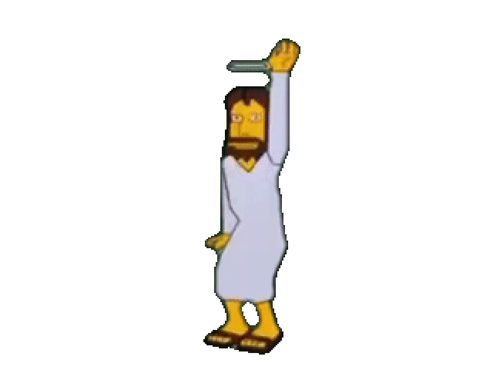

# The Dancing Jesus Homepage
A recreation of *The Dancing Jesus Homepage* from **The Simpsons**.

## Installation
1. Clone or download the repository.
2. Open 'index.html' in your browser.

### Audio Autoplay Issue
Modern browsers do not allow autoplaying audio tags without interacting with the page first.
Resolving this issue locally involves manually giving permission to the webpage.

1. Click the icon to the left of the address bar.
2. Open site settings or permissions from the menu.
3. Find sound or media autoplay permissions and set them to Allow.
    - Some browsers may require you to adjust permissions for all sites instead of just this one. You may need to open another permissions page in your browser settings.
4. Refresh the page to apply the changes.

## License
This project is licensed under the [MIT LICENSE](LICENSE). See the LICENSE file for details.

## Credits
Created by Anthony Alexis.

This project is a non-commercial fan remake of *The Dancing Jesus* page from **The Simpsons**.
